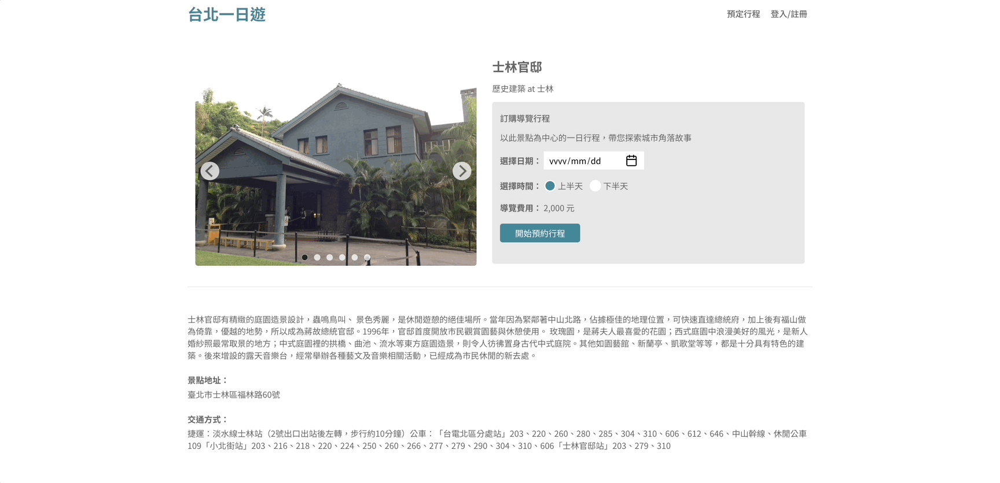
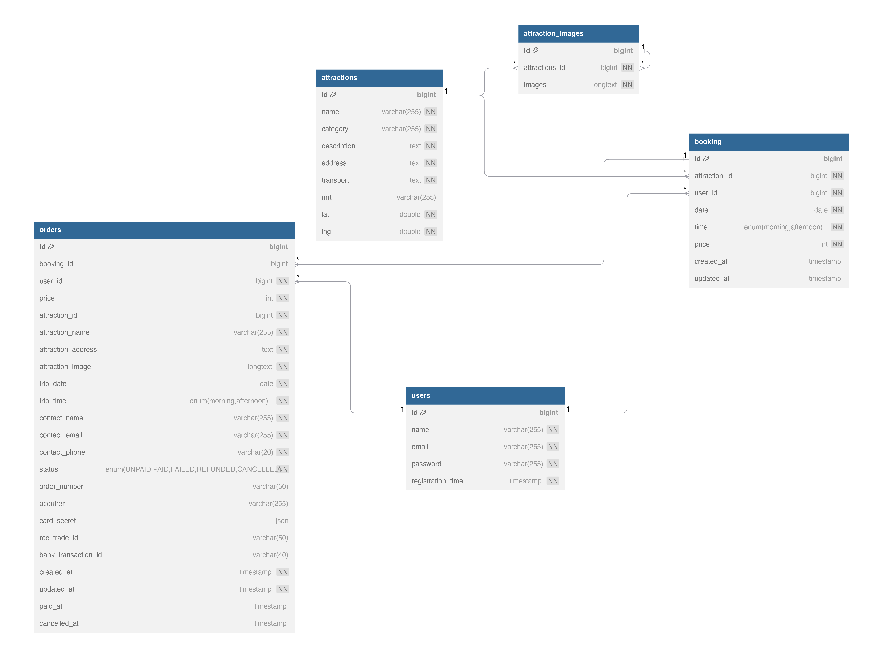
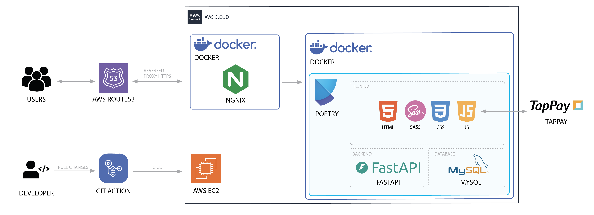

# Taipei Day Trip

> A travel e-commerce website that allows users to browse and book Taipei city tours.

<div align="center">
  <a href="https://youyuhsuan.com/">
    
    
  </a>
</div>

## Quick Links

- [Live Demo](https://youyuhsuan.com/)
- [API Documentation](https://youyuhsuan.com/docs)
- [Database Schema](https://dbdiagram.io/d/67271d9ab1b39dd85849dd13)
- [Docker Image](https://hub.docker.com/r/stellayou/taipei-day-trip)

## Demo

### Index Page

Experience our intuitive homepage design where users can effortlessly browse through various tour options.

<div align="center">
  
</div>

### Attraction Details

Explore detailed information about each attraction, including descriptions, images, and booking options.

<div align="center">
  
</div>

## Table of Contents

- [Tech Stack](#tech-stack)
- [Features](#features)
- [Installation](#installation)
  - [Prerequisites](#prerequisites)
  - [Setup Instructions](#setup-instructions)
- [Database Schema Documentation](#database-schema-documentation)
- [System Architecture](#system-architecture)
- [Docker Setup](#docker-setup)
- [Test Credentials](#test-credentials)
- [Test Card](#test-card)

## Tech Stack

### Frontend

<div>
  
  
  
  
</div>

### Backend & Database

<div>
  
  
  
  
</div>

### DevOps & Tools

<div>
  
  
  
  
</div>

### Cloud & Infrastructure

<div>
  
  
  
</div>

## Features

- **User Authentication**: Secure login and registration using JWT tokens.
- **Tour Browsing**: Browse available tours with detailed information.
- **Booking System**: Book tours directly through the platform.
- **Payment Integration**: Pay for bookings via TapPay.
- **Booking Management**: View and manage your bookings.

## Installation

### Prerequisites

- Python 3.12+
- Poetry (for Python dependency management)
- Docker (optional, if using Docker setup)

### Setup Instructions

1. **Clone the repository**

   ```bash
   git clone [repository_url]
   cd taipei-day-trip
   ```

2. **Set up the virtual environment with Poetry**

   ```bash
   poetry install
   poetry shell
   ```

3. **Configure environment variables**
   - Create a `.env` file in the project root directory
   - See `.env.example` for required variables

## Docker Setup

1. **Pull from Docker Hub**

   ```bash
   docker pull stellayou/taipei-day-trip
   ```

2. **Run with Docker Compose**
   ```bash
   docker compose -f docker-compose.yaml -f docker-compose.prod.yaml up -d
   ```

## [Database Schema Documentation](https://dbdiagram.io/d/67271d9ab1b39dd85849dd13)



## System Architecture



## Test Credentials

| Item     | Content          |
| :------- | :--------------- |
| Email    | test01@gmail.com |
| Password | Test01           |

## Test Card

For development and testing, please use the following test card:

| Item        | Content             |
| :---------- | :------------------ |
| Card Number | 4242 4242 4242 4242 |
| CVV         | 01/23               |
| Expiry Date | 123                 |
